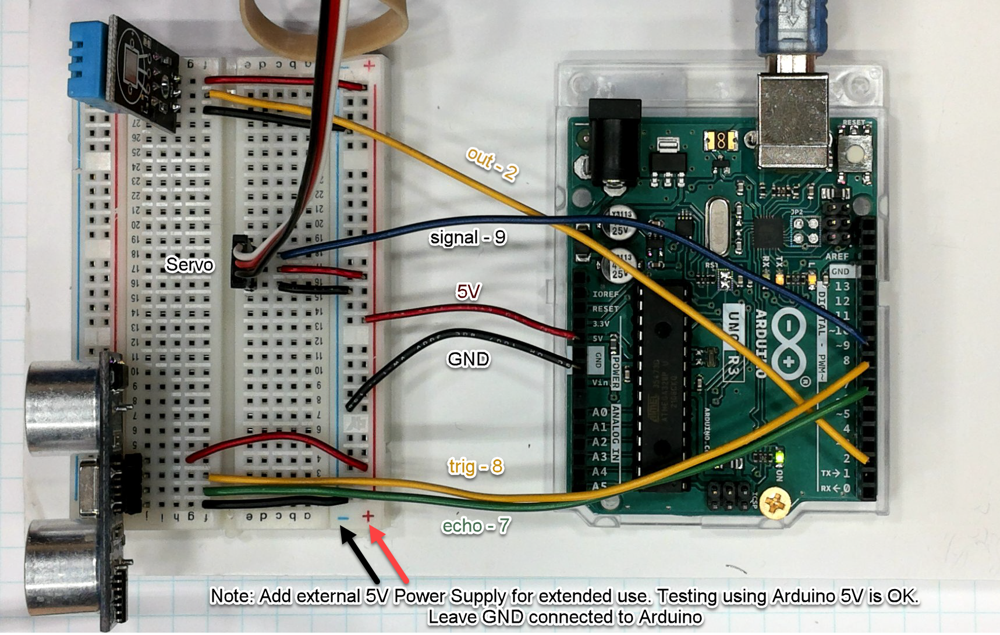

## SillyString Arduino

In the following steps we will test and setup our Arduino
and Silly String Launcher

---
### Arduino IDE - Editor
[Arduino](https://www.arduino.cc/en/software)

---
### Video Overview
[Overview](https://www.screencast.com/t/D2Rw2hTu)

---
### Connections
Note: I've used stright wire in image for clarity. <br/>
Hookup wires included with kit.


Note: Jump to final step 4 if you only want to connect servo
to lanuch SillyString

---
### Step 1 - Test Temp Sensor
#### Load ./arduino/temp/temp.ino
[video](https://www.screencast.com/t/VxsGYxGh2WXQ)
```
/*
 * Hardware Connections:
 *  Arduino | DHT11 
 *  -------------------
 *    5V    |   +     
 *    2     |   Out     
 *    GND   |   -
 */

```
---
### Step 2 - Test Ultrasonic Sensor
#### Load ./arduino/temp/ultrasonic.ino
```
/*
   Hardware Connections:
    Arduino | HC-SR04 
    -------------------
      5V    |   VCC     
      8     |   Trig     
      7     |   Echo     
      GND   |   GND
 
    Speed of sound in air at sea level (~776 m/h).
 */

```
---
### Step 3 - Servo
#### Load ./arduino/temp/servobasic.ino
[video](https://www.screencast.com/t/85Auy6Xd)
```
/*
   Hardware Connections:
    Arduino | Servo 
    -------------------
      9     |   Signal (check data sheet)    
      5V    |   Red +        
      GND   |   GND -
 
    Note: Test using the Arduino 5V OK. For long term use
    add a 5V power supply to breadboard. Keep GND connected
    between breadboard and Arduino.
 */

```
---
### Step 4 - Servo - Serial Connection
#### Load ./arduino/temp/servoserial.ino

Note: If you only want to connect SillyString keep this
sketch loaded. Otherwise load complete for all sensors.

Open terminal - send string 'launch'
```
```
---
### Step 5  - Complete - All devices
#### Load ./arduino/temp/complete.ino

Open terminal - send string 'launch'
```
```
---
### Step 6 - Get Rasperry Pi Server Running
[SillyString_RaspberryPI](https://github.com/prichardsondev/SillyString_RaspberryPi)
---
```
```
Note: See C++ version in ./c folder